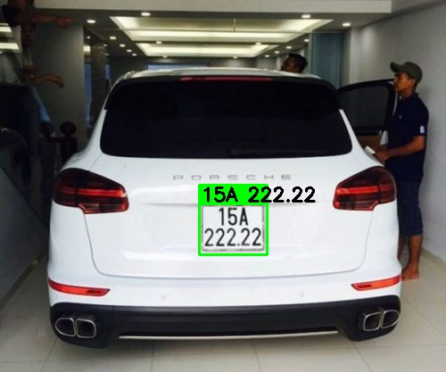
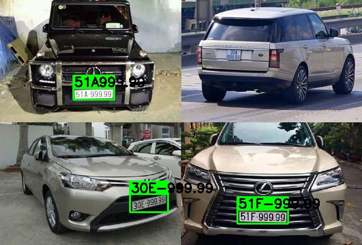
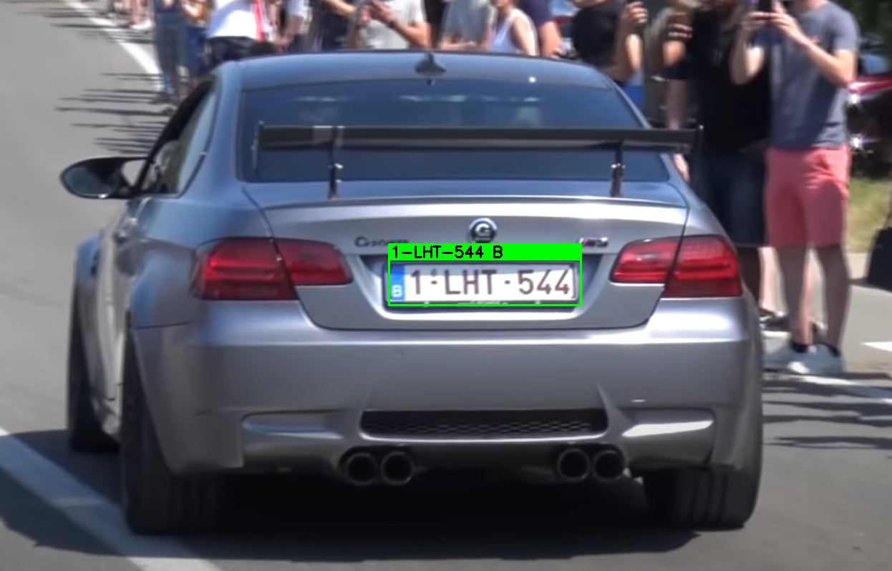

# ANPR using yolov8 and PaddleOCR

To run:

``python ANPR.py -image image_dir``

``python ANPR.py -video video_dir``

New files will be saved in the direct dir

To use gpu, install paddle gpu instead:

``pip install paddlepaddle-gpu``

The yolov8n model uses weights trained for only 30 epochs so the accuracy when detect license plate is low.
First, I extract license plates from picture using yolov8, then use PaddleOCR to recognize license plate number.
Here I use PaddleOCR because the accuracy is pretty high and no need for complex preprocessing.

Some predictions:

